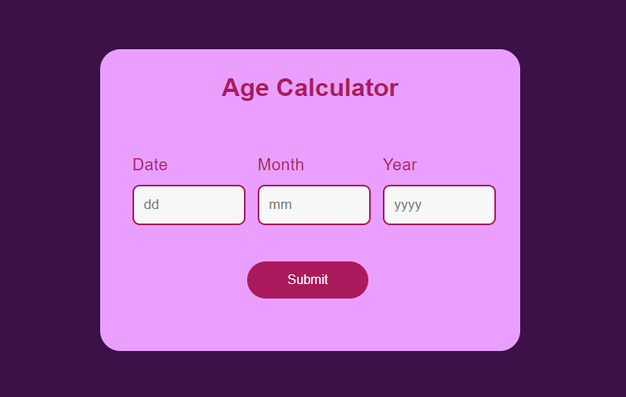
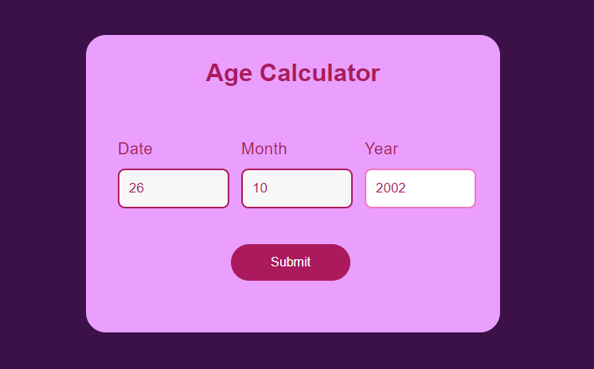
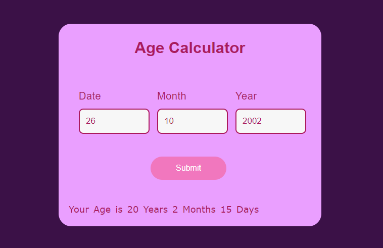

<h1 align="center">📊 Calculadora de Idade 📊</h1>

  
<h3 align="center"> Para calcular a idade do usuário, são solicitados os valores referentes ao dia, mês e ano de nascimento. Desta forma, é assim que fica preenchido: </h3>
  
<h3 align="center"> Após submeter os valores, a calculadora informa detalhadamente a idade do usuário, indicando o valor em ano(s), mes(es) e dia(s), assim como na foto a seguir. </h3>
  
Desafio feito por <a href="https://www.instagram.com/p/CmgrMsjv7Qj/"><em>Program With Fun</em></a>

<h3 align="center"> ⚡ Calculadora de idade criada usando as linguagens: HTML, CSS e JavaScript. ⚡</h3>